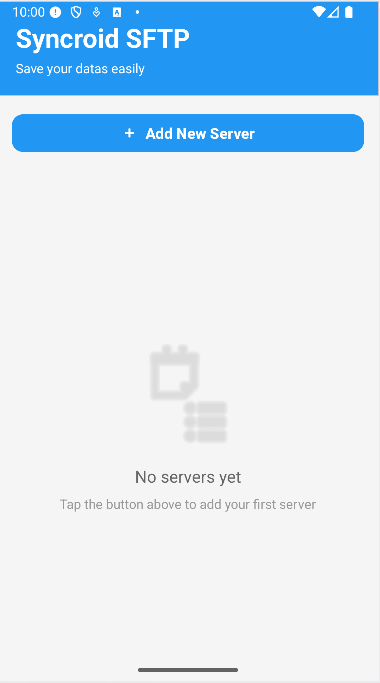
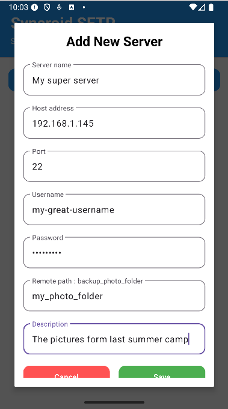
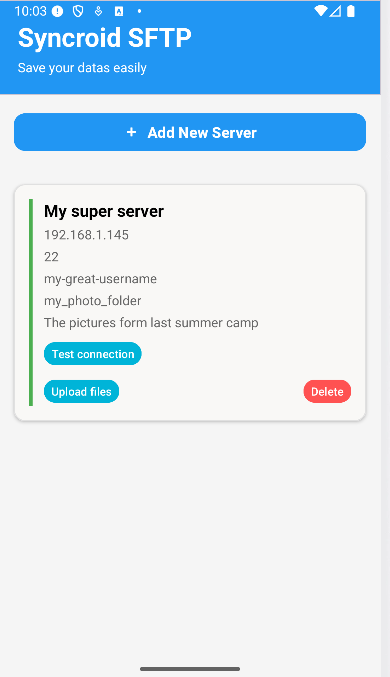
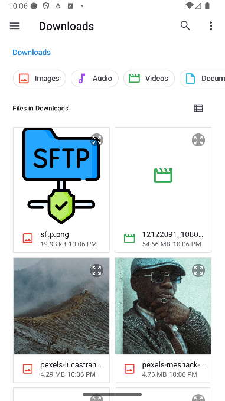

# Socle de l'application

[English version here](README.md)

Bientôt sur le Play Store (espérons-le), en attente de l’acceptation de Google pour cette
application

## Présentation

La principale raison pour laquelle j'ai créé cette application était de comprendre comment
fonctionnent les GitHub Actions, et comment automatiser la compilation, les tests et le déploiement
directement sur le Play Store. Je voulais maîtriser toute la chaîne DevOps et j'ai choisi de faire
ça avec un application android.

Cela dit, j'avais aussi besoin d'une application SFTP simple à utiliser chez moi, donc je l'ai
construite pour mon usage personnel.

### Demo

## Écran vide

Voici l'état quand il n'y a aucun serveur configuré :

---

## Ajouter un nouveau serveur

Cliquez sur **New Server** pour ajouter un serveur :

---

## Liste des serveurs

Voici la liste des serveurs configurés :

---

## Upload d’un fichier

Sélectionnez les fichiers à uploader :

## Sécurité

Les mots de passe sont encryptés avec AndroidKeyStore, ce qui garantit que les données sensibles
restent protégées sur l'appareil. La prochaine étape importante est d'ajouter l'authentification par
empreinte digitale pour se protéger contre les attaques de type man-in-the-middle, ainsi que
d'autres fonctionnalités de sécurité pour renforcer l'application.

## Envie de contribuer ?

N'hésitez pas, rendez-vous utile si vous le souhaitez. Il n'y a pas de règles strictes, mais
veuillez d'abord consulter les `issues`, vous y trouverez ce qui doit être fait.

### Règles

- Si, dans un paquet, vous avez deux classes portant le même nom ou ayant des responsabilités
  similaires (par exemple `CatScream` et `CatMovement`), créez un nouveau sous-paquet à l'intérieur
  de ce paquet pour les séparer (ce serait par exemple un sous-paquet `CatBehaviour`).
- Les classes qui contiennent une logique métier ou une logique de service doivent être testées
  avant d'être poussées, même s'il n'y a pas de couches de domaine claires ici.
- Ajoute des commentaires JavaDoc. Avec Gemini intégré, c’est devenu facile de nos jours… mais si
  Gemini génère 300 lignes pour un simple getter, n’hésite pas à nettoyer et ajuster un peu le
  bazar.

## À faire

- Ajouter l'authentification par empreinte digitale
- Refactoriser les classes UI désordonnées
- Créer un service de synchronisation qui télécharge automatiquement les fichiers selon un
  calendrier défini, en vérifiant la connexion au serveur avant de démarrer et en réessayant plus
  tard si la connexion est hors ligne

Comme il s'agit de ma première expérience avec Kotlin et Android, le code est assez désordonné et
mal organisé à certains endroits. Je dois décomposer le code en plusieurs parties plus petites dans
plusieurs domaines, et j'ai déjà commencé à le faire. N'hésitez pas à l'améliorer, je suis ouvert à
tous les commentaires !

---

Merci d'avoir jeté un œil !
